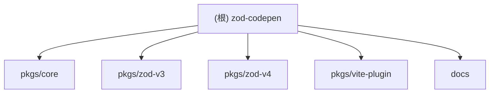

# Zod Codepen - 项目架构文档

> **最后更新**：2025-12-11 11:00:36 CST
> **版本**：1.0.2
> **自动生成**：本文档由 Claude Code 自动生成

## 变更记录 (Changelog)

### 2025-12-11 11:00:36
- 全面更新架构文档，增强模块结构图与导航体验
- 新增模块级文档面包屑导航，方便快速跳转
- 新增 Mermaid 交互式模块结构图，支持点击跳转
- 完善测试覆盖率分析（v3 10个测试套件，v4 9个测试套件）
- 新增数字格式化优化文档说明
- 补充 Vite 插件架构与使用场景

### 2025-12-10 22:03:57
- 初始化架构文档
- 完成全仓扫描与模块结构分析
- 生成根级与各模块级文档

---

## 项目愿景

Zod Codepen 是一个将 Zod Schema 对象序列化为纯 TypeScript/JavaScript 代码字符串的工具库。主要应用场景包括：
- Schema 可视化与调试
- 代码生成与文档自动化
- Zod v3/v4 迁移辅助
- 测试快照生成
- Vite 构建时 Schema 解耦（减少运行时依赖体积）

**核心特性**：
- 同时支持 Zod v3 和 v4（包括所有 v4 变体：zod、zod/mini、zod/v4 等）
- 支持 40+ Schema 类型（原语、集合、联合、修饰符、效果等）
- 代码优化（语义化方法如 `.positive()`、科学记数法 `2**31 - 1`）
- 格式化输出（可定制缩进与美化）
- 模块生成（生成完整的 TS/JS 模块并导出）
- 可扩展（注册自定义类型处理器）
- 零运行时开销（Tree-shakeable ESM）

---

## 架构总览

本项目采用 **Monorepo** 结构（pnpm workspace），分为核心引擎与版本适配器：

```
zod-codepen/
├── pkgs/                    # 核心代码包
│   ├── core/                # 版本无关的序列化引擎
│   ├── zod-v3/              # Zod v3 适配器
│   ├── zod-v4/              # Zod v4 适配器（含 mini/core 变体）
│   └── vite-plugin/         # Vite 插件（Schema 解耦）
├── docs/                    # VitePress 文档站点
│   ├── .vitepress/          # 配置与组件
│   ├── guide/               # 使用指南
│   ├── api/                 # API 参考
│   └── playground.md        # 在线 Playground
├── package.json             # 根工作空间配置
├── pnpm-workspace.yaml      # pnpm workspace 定义
├── tsconfig.base.json       # 共享 TypeScript 配置
├── .github/workflows/       # CI/CD（Cloudflare Pages 部署）
├── LICENSE                  # MPL-2.0
├── README.md                # 英文说明
├── README.zh_CN.md          # 中文说明
└── CONTRIBUTING.md          # 贡献指南
```

**技术栈**：
- **语言**：TypeScript 5.7+
- **包管理**：pnpm 10+
- **构建**：tsc（原生 TypeScript 编译器）
- **测试**：Vitest 2.1+
- **文档**：VitePress 1.5+
- **部署**：Cloudflare Pages（Wrangler）
- **代码规范**：ESLint 9+ + Prettier 3+

---

## 模块结构图



---

## 模块索引

| 模块路径 | 职责 | 语言 | 入口文件 | NPM 包 | 测试 |
|---------|------|------|---------|--------|------|
| [pkgs/core](./pkgs/core/CLAUDE.md) | 版本无关的序列化核心引擎，提供类型定义、处理器注册、格式化逻辑 | TypeScript | `src/index.ts` | `@zod-codepen/core@1.0.1` | 无（逻辑由适配器测试覆盖） |
| [pkgs/zod-v3](./pkgs/zod-v3/CLAUDE.md) | Zod v3 适配器，封装 v3 内部结构访问（`_def.typeName`） | TypeScript | `src/index.ts` | `@zod-codepen/zod-v3@1.0.1` | Vitest（10 个测试文件） |
| [pkgs/zod-v4](./pkgs/zod-v4/CLAUDE.md) | Zod v4 适配器，支持所有 v4 变体（`_zod.def.type`） | TypeScript | `src/index.ts` | `@zod-codepen/zod-v4@1.0.1` | Vitest（9 个测试文件） |
| [pkgs/vite-plugin](./pkgs/vite-plugin/CLAUDE.md) | Vite 构建插件，实现 Schema 解耦（预生成纯 Zod 代码替换重依赖） | TypeScript | `src/index.ts` | `@zod-codepen/vite-plugin@1.0.1` | 无（集成测试在用户项目中） |
| [docs](./docs/CLAUDE.md) | VitePress 文档站点，包含指南、API 参考、Playground | Markdown + Vue | `.vitepress/config.mts` | `@zod-codepen/docs@0.0.2` | 无 |

详细模块文档请点击表格中的模块路径或上方结构图中的节点。

---

## 运行与开发

### 环境要求
- Node.js >= 20
- pnpm >= 10.0.0

### 常用命令

```bash
# 安装依赖
pnpm install

# 构建所有包（必须先构建才能测试/运行）
pnpm build

# 运行所有测试
pnpm test

# 单独测试某个版本
pnpm test:v3    # 仅 Zod v3
pnpm test:v4    # 仅 Zod v4

# 清理构建产物
pnpm clean

# 代码检查
pnpm lint

# 文档开发服务器（http://localhost:5173）
pnpm docs:dev

# 构建文档（输出到 docs/.vitepress/dist）
pnpm docs:build

# 预览已构建的文档
pnpm docs:preview
```

### 开发流程
1. Fork 并 clone 仓库
2. 创建特性分支：`git checkout -b feat/your-feature`
3. 修改代码后运行 `pnpm build && pnpm test`
4. 提交符合 [Conventional Commits](https://www.conventionalcommits.org/) 规范的 commit
5. 提交 Pull Request

---

## 测试策略

### 测试组织
- **核心引擎（core）**：无独立测试，由 v3/v4 适配器测试覆盖
- **Zod v3 适配器**：10 个测试套件（共约 120+ 测试用例）
  - 基础类型（primitives）、字符串约束、数字约束、集合、组合类型、修饰符、效果、高级类型、模块生成、数字格式化
- **Zod v4 适配器**：9 个测试套件（覆盖相同场景 + v4 特性）
  - 包含适配器兼容性测试（`adapter.test.ts`）
  - 涵盖 v4 所有变体：zod、zod/mini、zod/v4、zod/v4/core
- **Vite 插件**：暂无单元测试，通过集成场景验证

### 测试工具
- **框架**：Vitest 2.1+
- **运行器**：`pnpm test`（所有包）或 `pnpm --filter <包名> test`
- **Watch 模式**：`pnpm --filter @zod-codepen/zod-v3 test:watch`

### 覆盖率目标
- Schema 类型覆盖：40+ 类型全覆盖
- 约束/修饰符：每个类型的主要约束均有测试
- 边界情况：null/undefined、空对象/数组、循环引用（lazy）

---

## 编码规范

### TypeScript 配置
- **编译目标**：ES2022
- **模块系统**：ESNext (ESM only)
- **严格模式**：启用 `strict`、`forceConsistentCasingInFileNames`
- **类型声明**：自动生成（`declaration: true`、`declarationMap: true`）
- **模块解析**：`bundler` 模式（支持 workspace 依赖）

### 代码风格
- **缩进**：2 空格
- **引号**：单引号（TypeScript/JavaScript）
- **分号**：按 ESLint 规则（推荐使用）
- **命名**：
  - 接口/类型：PascalCase（如 `SerializeOptions`）
  - 函数/变量：camelCase（如 `serialize`、`createSerializer`）
  - 常量：UPPER_SNAKE_CASE（如 `MAX_SAFE_INTEGER`）或 camelCase

### Lint 工具
- **ESLint 9+**：`pnpm lint`
- **Prettier 3+**：集成到 ESLint 中
- **Pre-commit**：建议使用 husky + lint-staged（项目暂未配置）

### 提交规范
遵循 [Conventional Commits](https://www.conventionalcommits.org/)：
- `feat:` 新功能
- `fix:` 修复 bug
- `docs:` 文档变更
- `test:` 测试相关
- `refactor:` 重构
- `chore:` 构建/工具变更

---

## AI 使用指引

### 如何向 AI 提问

**推荐问法**：
- "如何序列化一个包含嵌套对象和数组的 Zod schema？"
- "Zod v3 和 v4 的适配器有什么区别？"
- "我想在 Vite 项目中使用 zod-codepen 插件减少运行时依赖体积，怎么配置？"
- "如何注册自定义 Schema 类型的处理器？"
- "为什么我的 schema 序列化后输出了 `/* not a zod schema */`？"
- "数字格式化优化是如何工作的？"

**不推荐问法**：
- "帮我改代码"（请先阅读模块文档和 API 参考）
- "这个项目是干嘛的？"（请先阅读 README 和本文档的"项目愿景"）

### 常见任务路径

| 任务 | 应查阅的文档/文件 |
|------|------------------|
| 快速开始使用 | `README.md` → `docs/guide/getting-started.md` |
| 了解序列化选项 | `docs/api/serialize.md` → `pkgs/core/src/types.ts` |
| 添加自定义类型支持 | `CONTRIBUTING.md` → `pkgs/core/src/serializer.ts` |
| Zod v3/v4 内部差异 | `docs/guide/v3-v4-differences.md` → `pkgs/zod-v*/src/adapter.ts` |
| Vite 插件配置 | `docs/guide/vite-plugin.md` → `pkgs/vite-plugin/src/index.ts` |
| 数字格式化逻辑 | `pkgs/core/src/number-formatter.ts` |

### 项目结构导航提示
- **核心逻辑**：`pkgs/core/src/serializer.ts`（~1100+ 行，包含所有内置类型处理器）
- **类型定义**：`pkgs/core/src/types.ts`（75 行，定义所有接口）
- **适配器实现**：
  - V3: `pkgs/zod-v3/src/adapter.ts`（50 行）
  - V4: `pkgs/zod-v4/src/adapter.ts`（122 行，处理多变体）
- **测试示例**：`pkgs/zod-v3/test/` 或 `pkgs/zod-v4/test/`（每个测试文件对应一类 Schema）

### AI 辅助开发建议
1. **添加新类型支持**：先查看 `serializer.ts` 中已有的 `builtinHandlers.set()` 模式，然后在两个适配器的测试目录中添加对应测试。
2. **调试序列化结果**：使用 `serialize(schema, { format: false })` 关闭格式化，更容易对比输出。
3. **理解 v3/v4 差异**：直接阅读 `adapter.ts` 的注释，关键在于 `_def.typeName` vs `_zod.def.type`。
4. **优化数字输出**：查看 `number-formatter.ts`，了解哪些数字会被转换为 `2**31 - 1` 等形式。

---

## 相关资源

- **在线 Playground**：https://zod-codepen.corn.im/playground
- **文档站点**：https://zod-codepen.corn.im
- **GitHub 仓库**：https://github.com/CornWorld/zod-codepen
- **NPM 包**：
  - https://www.npmjs.com/package/@zod-codepen/zod-v3
  - https://www.npmjs.com/package/@zod-codepen/zod-v4
  - https://www.npmjs.com/package/@zod-codepen/vite-plugin
- **Zod 官方文档**：
  - v3: https://zod.dev
  - v4: https://github.com/colinhacks/zod/tree/v4

---

## 许可证与贡献

- **许可证**：[MPL-2.0 | Mozilla Public License 2.0](./LICENSE)
- **作者**：[CornWorld](https://github.com/CornWorld)
- **贡献指南**：[CONTRIBUTING.md](./CONTRIBUTING.md)
- **声明**：本项目与 CodePen.io 无关，"codepen" 只是描述"像笔一样轻松地将 Zod Schema 写成代码字符串"。
