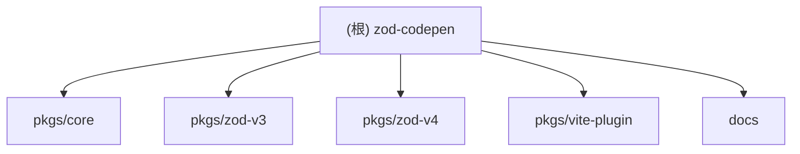

# Zod Codepen - 项目架构文档

> **最后更新**：2026-07-05
> **版本**：1.0.2
> **自动生成**：本文档由 Claude Code 自动生成

## 变更记录 (Changelog)

### 2026-07-05

- 重构为 IR（中间表示）架构：Zod Schema → cast → IRNode → codegen → Code String
- 新增静态 AST 提取管线（castFromAst / castAllFromAst）
- 新增跨文件 schema 解析（ModuleResolver）
- 序列化器瘦身：1181 行 → 142 行
- 测试增强：core 0→129 / vite-plugin 0→64，全仓 401 测试全绿

### 2025-12-11 11:00:36

- 全面更新架构文档，增强模块结构图与导航体验
- 新增模块级文档面包屑导航，方便快速跳转
- 新增 Mermaid 交互式模块结构图，支持点击跳转
- 完善测试覆盖率分析（v3 10 个测试套件，v4 9 个测试套件）
- 新增数字格式化优化文档说明
- 补充 Vite 插件架构与使用场景

### 2025-12-10 22:03:57

- 初始化架构文档
- 完成全仓扫描与模块结构分析
- 生成根级与各模块级文档

---

## 项目愿景

Zod Codepen 是一个将 Zod Schema 对象序列化为纯 TypeScript/JavaScript 代码字符串的工具库。主要应用场景包括：

- Schema 可视化与调试
- 代码生成与文档自动化
- Zod v3/v4 迁移辅助
- 测试快照生成
- Vite 构建时 Schema 解耦（减少运行时依赖体积）

**核心特性**：

- 同时支持 Zod v3 和 v4（包括所有 v4 变体：zod、zod/mini、zod/v4 等）
- 支持 40+ Schema 类型（原语、集合、联合、修饰符、效果等）
- 代码优化（语义化方法如 `.positive()`、科学记数法 `2**31 - 1`）
- 格式化输出（可定制缩进与美化）
- 模块生成（生成完整的 TS/JS 模块并导出）
- 静态 AST 提取（不执行用户代码即可从 TypeScript 源码提取 Zod schema）
- 跨文件 Schema 解析（支持 import 追踪与 spread 合并）
- IR 架构（版本无关的中间表示，分离 cast 与 codegen）
- 零运行时开销（Tree-shakeable ESM）

---

## 架构

本项目采用 **IR（中间表示）架构**，将序列化过程分为两个阶段：

```
Zod Schema → cast/ (caster) → IRNode → ir/printer/codegen → Code String
```

两条 cast 路径：

- **castFromZod()**：运行时路径，需要实际 Zod 对象（`pkgs/core/src/cast/runtime.ts`）
- **castFromAst()**：静态 AST 路径，解析 TypeScript 源码文本（`pkgs/core/src/cast/ast.ts`）

核心模块：

- `pkgs/core/src/ir/nodes.ts` — 21 种 IR 节点类型定义
- `pkgs/core/src/ir/printer/codegen.ts` — IR → 代码字符串（纯函数，无 Zod 依赖）
- `pkgs/core/src/cast/` — 两种 cast 实现
- `pkgs/core/src/serializer.ts` — 序列化器薄壳（仅 142 行，路由到 IR 管道）

## 架构总览

本项目采用 **Monorepo** 结构（pnpm workspace），分为核心引擎与版本适配器：

```
zod-codepen/
├── pkgs/                    # 核心代码包
│   ├── core/                # 版本无关的序列化引擎
│   ├── zod-v3/              # Zod v3 适配器
│   ├── zod-v4/              # Zod v4 适配器（含 mini/core 变体）
│   └── vite-plugin/         # Vite 插件（Schema 解耦）
├── docs/                    # VitePress 文档站点
│   ├── .vitepress/          # 配置与组件
│   ├── guide/               # 使用指南
│   ├── api/                 # API 参考
│   └── playground.md        # 在线 Playground
├── package.json             # 根工作空间配置
├── pnpm-workspace.yaml      # pnpm workspace 定义
├── tsconfig.base.json       # 共享 TypeScript 配置
├── .github/workflows/       # CI/CD（Cloudflare Pages 部署）
├── LICENSE                  # MPL-2.0
├── README.md                # 英文说明
├── README.zh_CN.md          # 中文说明
└── CONTRIBUTING.md          # 贡献指南
```

**技术栈**：

- **语言**：TypeScript 5.7+
- **包管理**：pnpm 10+
- **构建**：tsc（原生 TypeScript 编译器）
- **测试**：Vitest 2.1+
- **文档**：VitePress 1.5+
- **部署**：Cloudflare Pages（Wrangler）
- **代码规范**：ESLint 9+ + Prettier 3+

---

## 模块结构图


```mermaid
graph TD
    A["(根) zod-codepen"] --> B["pkgs/core"];
    A --> C["pkgs/zod-v3"];
    A --> D["pkgs/zod-v4"];
    A --> E["pkgs/vite-plugin"];
    A --> F["docs"];

    click B "./pkgs/core/CLAUDE.md" "查看 core 模块文档"
    click C "./pkgs/zod-v3/CLAUDE.md" "查看 zod-v3 模块文档"
    click D "./pkgs/zod-v4/CLAUDE.md" "查看 zod-v4 模块文档"
    click E "./pkgs/vite-plugin/CLAUDE.md" "查看 vite-plugin 模块文档"
    click F "./docs/CLAUDE.md" "查看 docs 模块文档"
```

---

## 模块索引

| 模块路径                                         | 职责                                                                              | 语言           | 入口文件                | NPM 包                           | 测试                                         |
| ------------------------------------------------ | --------------------------------------------------------------------------------- | -------------- | ----------------------- | -------------------------------- | -------------------------------------------- |
| [pkgs/core](./pkgs/core/CLAUDE.md)               | 版本无关的序列化核心引擎，IR 节点定义、codegen、双 cast 路径（运行时 + 静态 AST） | TypeScript     | `src/index.ts`          | `@zod-codepen/core@1.0.1`        | Vitest（4 个测试文件，129 个测试）           |
| [pkgs/zod-v3](./pkgs/zod-v3/CLAUDE.md)           | Zod v3 适配器，封装 v3 内部结构访问（`_def.typeName`）                            | TypeScript     | `src/index.ts`          | `@zod-codepen/zod-v3@1.0.1`      | Vitest（10 个测试文件，155 个测试）          |
| [pkgs/zod-v4](./pkgs/zod-v4/CLAUDE.md)           | Zod v4 适配器，支持所有 v4 变体（`_zod.def.type`）                                | TypeScript     | `src/index.ts`          | `@zod-codepen/zod-v4@1.0.1`      | Vitest（9 个测试文件，53 个测试 + 4 个跳过） |
| [pkgs/vite-plugin](./pkgs/vite-plugin/CLAUDE.md) | Vite 构建插件，运行时 + 静态两种 Schema 解耦模式                                  | TypeScript     | `src/index.ts`          | `@zod-codepen/vite-plugin@1.0.1` | Vitest（6 个测试文件，64 个测试）            |
| [docs](./docs/CLAUDE.md)                         | VitePress 文档站点，包含指南、API 参考、Playground                                | Markdown + Vue | `.vitepress/config.mts` | `@zod-codepen/docs@0.0.2`        | 无                                           |

详细模块文档请点击表格中的模块路径或上方结构图中的节点。

---

## 运行与开发

### 环境要求

- Node.js >= 20
- pnpm >= 10.0.0

### 常用命令

```bash
# 安装依赖
pnpm install

# 构建所有包（必须先构建才能测试/运行）
pnpm build

# 运行所有测试
pnpm test

# 单独测试某个版本
pnpm test:v3    # 仅 Zod v3
pnpm test:v4    # 仅 Zod v4

# 清理构建产物
pnpm clean

# 代码检查
pnpm lint

# 文档开发服务器（http://localhost:5173）
pnpm docs:dev

# 构建文档（输出到 docs/.vitepress/dist）
pnpm docs:build

# 预览已构建的文档
pnpm docs:preview
```

### 开发流程

1. Fork 并 clone 仓库
2. 创建特性分支：`git checkout -b feat/your-feature`
3. 修改代码后运行 `pnpm build && pnpm test`
4. 提交符合 [Conventional Commits](https://www.conventionalcommits.org/) 规范的 commit
5. 提交 Pull Request

---

## 测试策略

### 测试组织

- **核心引擎（core）**：4 个测试文件，129 个测试
  - AST 工具、cast-ast、extract、resolver
- **Zod v3 适配器**：10 个测试文件，155 个测试
  - 基础类型、字符串/数字约束、集合、组合类型、修饰符、效果、高级类型、模块生成、数字格式化
- **Zod v4 适配器**：9 个测试文件，53 个测试 + 4 个跳过
  - 覆盖相同场景 + v4 特性 + 适配器兼容性测试
- **Vite 插件**：6 个测试文件，64 个测试
  - 适配器、静态提取、插件、生成 schemas、E2E

### 测试工具

- **框架**：Vitest 2.1+
- **运行器**：`pnpm test`（所有包）或 `pnpm --filter <包名> test`
- **总测试数**：401 个测试，0 失败
- Schema 类型覆盖：40+ 类型全覆盖
- 约束/修饰符：每个类型的主要约束均有测试
- 边界情况：null/undefined、空对象/数组、循环引用（lazy）

---

## 编码规范

### TypeScript 配置

- **编译目标**：ES2022
- **模块系统**：ESNext (ESM only)
- **严格模式**：启用 `strict`、`forceConsistentCasingInFileNames`
- **类型声明**：自动生成（`declaration: true`、`declarationMap: true`）
- **模块解析**：`bundler` 模式（支持 workspace 依赖）

### 代码风格

- **缩进**：2 空格
- **引号**：单引号（TypeScript/JavaScript）
- **分号**：按 ESLint 规则（推荐使用）
- **命名**：
  - 接口/类型：PascalCase（如 `SerializeOptions`）
  - 函数/变量：camelCase（如 `serialize`、`createSerializer`）
  - 常量：UPPER_SNAKE_CASE（如 `MAX_SAFE_INTEGER`）或 camelCase

### Lint 工具

- **ESLint 9+**：`pnpm lint`
- **Prettier 3+**：集成到 ESLint 中
- **Pre-commit**：建议使用 husky + lint-staged（项目暂未配置）

### 提交规范

遵循 [Conventional Commits](https://www.conventionalcommits.org/)：

- `feat:` 新功能
- `fix:` 修复 bug
- `docs:` 文档变更
- `test:` 测试相关
- `refactor:` 重构
- `chore:` 构建/工具变更

---

## AI 使用指引

### 如何向 AI 提问

**推荐问法**：

- "如何序列化一个包含嵌套对象和数组的 Zod schema？"
- "Zod v3 和 v4 的适配器有什么区别？"
- "我想在 Vite 项目中使用 zod-codepen 插件减少运行时依赖体积，怎么配置？"
- "如何注册自定义 Schema 类型的处理器？"
- "为什么我的 schema 序列化后输出了 `/* not a zod schema */`？"
- "数字格式化优化是如何工作的？"

**不推荐问法**：

- "帮我改代码"（请先阅读模块文档和 API 参考）
- "这个项目是干嘛的？"（请先阅读 README 和本文档的"项目愿景"）

### 常见任务路径

| 任务               | 应查阅的文档/文件                                                |
| ------------------ | ---------------------------------------------------------------- |
| 快速开始使用       | `README.md` → `docs/guide/getting-started.md`                    |
| 了解序列化选项     | `docs/api/serialize.md` → `pkgs/core/src/types.ts`               |
| 添加自定义类型支持 | `CONTRIBUTING.md` → `pkgs/core/src/serializer.ts`                |
| Zod v3/v4 内部差异 | `docs/guide/v3-v4-differences.md` → `pkgs/zod-v*/src/adapter.ts` |
| Vite 插件配置      | `docs/guide/vite-plugin.md` → `pkgs/vite-plugin/src/index.ts`    |
| 数字格式化逻辑     | `pkgs/core/src/number-formatter.ts`                              |

### 项目结构导航提示

- **IR 节点定义**：`pkgs/core/src/ir/nodes.ts`（322 行，21 种节点类型）
- **Codegen**：`pkgs/core/src/ir/printer/codegen.ts`（577 行，IR → 代码）
- **运行时 cast**：`pkgs/core/src/cast/runtime.ts`（689 行，castFromZod）
- **静态 AST cast**：`pkgs/core/src/cast/ast.ts`（1329 行，castFromAst）
- **序列化器**：`pkgs/core/src/serializer.ts`（142 行，路由到 IR 管道）
- **类型定义**：`pkgs/core/src/types.ts`
- **适配器实现**：
  - V3: `pkgs/zod-v3/src/adapter.ts`
  - V4: `pkgs/zod-v4/src/adapter.ts`
- **测试示例**：`pkgs/zod-v3/test/` 或 `pkgs/zod-v4/test/`

### AI 辅助开发建议

1. **添加新类型支持**：先在 `pkgs/core/src/ir/nodes.ts` 添加 IR 节点（如需），然后在 `pkgs/core/src/ir/printer/codegen.ts` 添加渲染逻辑，最后在对应的 cast 实现中添加类型映射。
2. **调试序列化结果**：使用 `codegen(ir, { format: false })` 关闭格式化，更容易对比输出。使用 `castFromAst(source, name)` 进行纯文本调试。
3. **理解 v3/v4 差异**：直接阅读 `adapter.ts` 的注释，关键在于 `_def.typeName` vs `_zod.def.type`。
4. **优化数字输出**：查看 `number-formatter.ts`，了解哪些数字会被转换为 `2**31 - 1` 等形式。

---

## 相关资源

- **在线 Playground**：https://zod-codepen.corn.im/playground
- **文档站点**：https://zod-codepen.corn.im
- **GitHub 仓库**：https://github.com/CornWorld/zod-codepen
- **NPM 包**：
  - https://www.npmjs.com/package/@zod-codepen/zod-v3
  - https://www.npmjs.com/package/@zod-codepen/zod-v4
  - https://www.npmjs.com/package/@zod-codepen/vite-plugin
- **Zod 官方文档**：
  - v3: https://zod.dev
  - v4: https://github.com/colinhacks/zod/tree/v4

---

## 许可证与贡献

- **许可证**：[MPL-2.0 | Mozilla Public License 2.0](./LICENSE)
- **作者**：[CornWorld](https://github.com/CornWorld)
- **贡献指南**：[CONTRIBUTING.md](./CONTRIBUTING.md)
- **声明**：本项目与 CodePen.io 无关，"codepen" 只是描述"像笔一样轻松地将 Zod Schema 写成代码字符串"。
