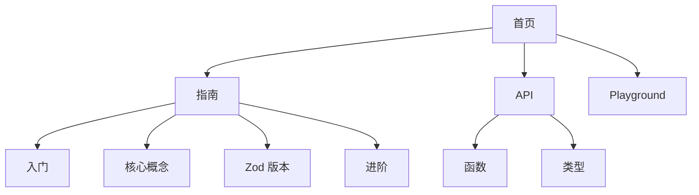

# Docs 模块 - 文档站点

[根目录](../CLAUDE.md) > **docs**

---

## 模块职责

`@zod-codepen/docs` 是基于 VitePress 的文档站点，提供：
- 完整的使用指南（入门、核心概念、进阶）
- API 参考文档（函数签名、类型定义）
- 在线 Playground（交互式 Schema 序列化演示）
- Zod v3/v4 差异对比
- 中英文双语支持（当前主要为中文）

**部署方式**：
- **平台**：Cloudflare Pages
- **CI/CD**：GitHub Actions（自动部署 main 分支）
- **域名**：https://zod-codepen.corn.im

---

## 入口与启动

### 主配置
- **文件**：`.vitepress/config.mts`（150 行）
- **配置内容**：
  - 站点元信息（标题、描述、favicon）
  - 导航栏与侧边栏结构
  - 主题配置（logo、搜索、footer）
  - Markdown 渲染选项（代码高亮主题）

### 本地开发
```bash
# 启动开发服务器（http://localhost:5173）
pnpm --filter @zod-codepen/docs dev

# 或在 docs 目录下
cd docs
pnpm dev
```

### 构建与部署
```bash
# 构建静态站点
pnpm docs:build

# 本地预览构建结果
pnpm docs:preview

# 部署到 Cloudflare Pages（需配置 wrangler）
pnpm --filter @zod-codepen/docs deploy
```

---

## 对外接口

### 文档结构

#### 入门指南 (`/guide/`)
- **introduction.md** - 项目简介
- **getting-started.md** - 快速开始
- **installation.md** - 安装说明

#### 核心概念
- **basic-usage.md** - 基本用法
- **optimizations.md** - 代码优化
- **formatting.md** - 格式化选项
- **module-generation.md** - 模块生成

#### Zod 版本
- **zod-v3.md** - v3 适配器使用
- **zod-v4.md** - v4 适配器使用
- **v3-v4-differences.md** - v3/v4 差异对比

#### 进阶
- **vite-plugin.md** - Vite 插件使用
- **custom-handlers.md** - 自定义处理器
- **supported-types.md** - 支持的类型列表
- **playground.md** - 在线 Playground

#### API 参考 (`/api/`)
- **serialize.md** - serialize() 函数
- **generate-module.md** - generateModule() 函数
- **register-handler.md** - registerHandler() 函数
- **create-serializer.md** - createSerializer() 函数
- **vite-plugin.md** - Vite 插件 API

#### 类型定义 (`/api/types/`)
- **serialize-options.md** - SerializeOptions 类型
- **zod-adapter.md** - ZodAdapter 接口
- **schema-handler.md** - SchemaHandler 类型

### 组件

#### Playground.vue
- **位置**：`.vitepress/components/Playground.vue`
- **功能**：交互式 Schema 序列化演示
- **依赖**：`@zod-codepen/zod-v3`、`@zod-codepen/zod-v4`
- **特性**：
  - 实时代码编辑
  - 动态序列化输出
  - 支持 v3/v4 切换
  - 代码高亮显示

---

## 关键依赖与配置

### 依赖项
- **Dependencies**：`shiki@^1.0.0`（代码高亮）
- **Dev Dependencies**：
  - `vitepress@^1.5.0`（文档框架）
  - `wrangler@^4.53.0`（Cloudflare Pages 部署）
  - `@zod-codepen/zod-v3@workspace:*`（Playground 使用）
  - `@zod-codepen/zod-v4@workspace:*`（Playground 使用）

### VitePress 配置
```typescript
// .vitepress/config.mts
export default defineConfig({
  title: "zod-codepen",
  description: "Serialize Zod schemas to pure Zod code strings at runtime",
  base: '/',
  cleanUrls: true,

  markdown: {
    lineNumbers: false,
    theme: {
      light: 'github-light',
      dark: 'github-dark'
    }
  },

  themeConfig: {
    logo: '/logo.svg',
    search: {
      provider: 'local',  // 本地搜索
      options: {
        translations: {
          button: { buttonText: '搜索文档' },
          // ...
        }
      }
    },
    editLink: {
      pattern: 'https://github.com/CornWorld/zod-codepen/edit/main/docs/:path',
      text: '在 GitHub 上编辑此页'
    }
  }
})
```

### Cloudflare Pages 配置
- **项目名称**：`zod-codepen`
- **构建输出**：`.vitepress/dist`
- **部署分支**：`main`（自动部署）、`preview`（预览部署）

---

## 数据模型

### 导航结构



### 文档文件结构
```
docs/
├── index.md                # 首页
├── guide/                  # 指南
│   ├── introduction.md
│   ├── getting-started.md
│   ├── installation.md
│   ├── basic-usage.md
│   ├── optimizations.md
│   ├── formatting.md
│   ├── module-generation.md
│   ├── zod-v3.md
│   ├── zod-v4.md
│   ├── v3-v4-differences.md
│   ├── vite-plugin.md
│   ├── custom-handlers.md
│   └── supported-types.md
├── api/                    # API 参考
│   ├── serialize.md
│   ├── generate-module.md
│   ├── register-handler.md
│   ├── create-serializer.md
│   ├── vite-plugin.md
│   └── types/
│       ├── serialize-options.md
│       ├── zod-adapter.md
│       └── schema-handler.md
├── playground.md           # Playground
└── .vitepress/
    ├── config.mts          # 配置
    ├── components/         # 组件
    │   └── Playground.vue
    ├── cache/              # 缓存（gitignore）
    └── dist/               # 构建产物（gitignore）
```

---

## 测试与质量

### 测试策略
- **本模块无自动化测试**：文档站点通过人工审查
- **验证方式**：
  - 本地构建预览（`pnpm docs:build && pnpm docs:preview`）
  - CI/CD 构建成功（GitHub Actions）
  - 在线站点可访问性测试

### 质量保证
- Markdown 链接检查（VitePress 内置）
- 代码示例语法高亮验证
- Playground 组件功能测试

### 待改进
- [ ] 添加文档链接自动化检查
- [ ] 添加代码示例自动化测试（确保示例代码可运行）
- [ ] 添加 lighthouse 性能测试

---

## 常见问题 (FAQ)

### Q1: 如何添加新文档页面？
A:
1. 在对应目录创建 `.md` 文件
2. 在 `.vitepress/config.mts` 的 `sidebar` 中添加链接
3. 提交到 GitHub，CI 会自动部署

### Q2: Playground 如何工作？
A: Playground 组件（`Playground.vue`）：
- 使用 Monaco Editor 或 textarea 作为代码编辑器
- 动态导入 `@zod-codepen/zod-v3` 或 `@zod-codepen/zod-v4`
- 实时调用 `serialize()` 并展示结果
- 使用 Shiki 高亮输出代码

### Q3: 如何本地测试 Cloudflare Pages 部署？
A:
```bash
# 安装 wrangler
pnpm add -D wrangler

# 本地构建
pnpm docs:build

# 使用 wrangler 预览
cd docs
pnpx wrangler pages dev .vitepress/dist
```

### Q4: 文档搜索功能如何实现？
A: 使用 VitePress 内置的本地搜索（`search.provider: 'local'`），无需外部服务。

### Q5: 如何更新文档主题？
A: 编辑 `.vitepress/config.mts` 中的 `themeConfig`，VitePress 支持丰富的自定义选项。

---

## 相关文件清单

### 配置文件
- `.vitepress/config.mts`（150 行）：VitePress 配置
- `package.json`：包元数据与部署脚本
- `wrangler.toml`（如果存在）：Cloudflare Pages 配置

### 文档文件
- `index.md`：首页
- `guide/*.md`：指南（13 个文件）
- `api/*.md`：API 参考（5 个函数 + 3 个类型）
- `playground.md`：Playground 页面

### 组件
- `.vitepress/components/Playground.vue`：交互式 Playground

### 构建产物（gitignore）
- `.vitepress/dist/`：静态站点
- `.vitepress/cache/`：VitePress 缓存

### Node 缓存（gitignore）
- `node_modules/.cache/wrangler/`：Wrangler 缓存
- `node_modules/.mf/`：Miniflare 缓存

---

## 变更记录 (Changelog)

### 2025-12-11
- 初始化文档模块说明
- 完成站点结构扫描
- 新增 Playground 组件说明
- 补充 Cloudflare Pages 部署流程
