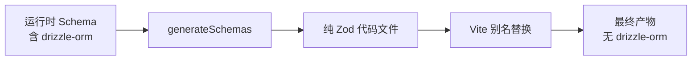

# Vite Plugin

`@zod-codepen/vite-plugin` 提供 Schema 解耦功能，允许你在构建时将依赖重型库（如 drizzle-orm）的 Zod Schema 转换为纯 Zod 代码文件，从而减少最终产物体积。

## 为什么需要 Vite Plugin？

在使用 ORM（如 Drizzle）定义数据模型时，Schema 通常与 ORM 库紧密耦合：

```typescript
// 原始代码 - 依赖 drizzle-orm
import { createSelectSchema } from "drizzle-zod";
import { users } from "./db/schema";

export const UserSchema = createSelectSchema(users);
```

问题：

- **打包体积**：整个 drizzle-orm 会被打包进前端代码
- **Cloudflare Workers**：对包体积敏感的环境无法容纳大型 ORM
- **运行时依赖**：客户端需要加载不必要的服务端库

解决方案：使用 vite-plugin 在构建时生成纯 Zod 代码，运行时只需要轻量的 zod 库。

## 安装

::: code-group

```bash [pnpm]
pnpm add -D @zod-codepen/vite-plugin
```

```bash [npm]
npm install -D @zod-codepen/vite-plugin
```

```bash [yarn]
yarn add -D @zod-codepen/vite-plugin
```

:::

## 使用模式

### 模式 1：独立脚本 + 别名插件（推荐）

最灵活的方式，适合大多数项目。

#### 步骤 1：创建生成脚本

```typescript
// scripts/generate-schemas.ts
import { generateSchemas } from "@zod-codepen/vite-plugin";
import * as schemas from "../src/runtime/schema.js";

await generateSchemas({
  schemas,
  outputPath: "./src/generated/api-schemas.ts",
  zodVersion: "v4",
  verbose: true,
});

console.log("✅ Schemas generated successfully!");
```

#### 步骤 2：配置 Vite

```typescript
// vite.config.ts
import { defineConfig } from "vite";
import { zodDecouplingAlias } from "@zod-codepen/vite-plugin";

export default defineConfig({
  plugins: [
    zodDecouplingAlias({
      // 原始导入路径（代码中使用的）
      aliasFrom: "../runtime/schema.js",
      // 生成文件的路径（构建时替换）
      aliasTo: "./src/generated/api-schemas.ts",
    }),
  ],
});
```

#### 步骤 3：配置 package.json

```json
{
  "scripts": {
    "generate:schemas": "tsx scripts/generate-schemas.ts",
    "build": "pnpm generate:schemas && vite build",
    "dev": "vite"
  }
}
```

### 模式 2：一体化插件（简单场景）

适合 Schema 文件在构建时可直接导入的情况。

```typescript
// vite.config.ts
import { defineConfig } from "vite";
import { zodDecoupling } from "@zod-codepen/vite-plugin";

export default defineConfig({
  plugins: [
    zodDecoupling({
      schemaEntry: "./src/runtime/schema.ts",
      outputPath: "./src/generated/api-schemas.ts",
      aliasFrom: "../runtime/schema.js",
      zodVersion: "v4",
    }),
  ],
});
```

::: warning 注意
一体化插件要求 schema 文件在 Vite 构建时可导入。如果 schema 依赖 drizzle-orm 等服务端库，请使用模式 1。
:::

## API 参考

### generateSchemas(options)

独立生成函数，将运行时 Schema 序列化为纯 Zod 代码文件。

```typescript
interface GenerateSchemaOptions {
  // Schema 映射对象（键为导出名，值为 Zod schema）
  schemas: Record<string, unknown>;

  // 输出文件路径
  outputPath: string;

  // Zod 版本（默认 'v4'）
  zodVersion?: "v3" | "v4";

  // 过滤函数（默认排除 $ 前缀和 Type 后缀）
  filter?: (name: string, schema: unknown) => boolean;

  // 是否生成类型导出（默认 true）
  includeTypes?: boolean;

  // 自定义文件头
  header?: string;

  // 序列化选项
  serializeOptions?: SerializeOptions;

  // 详细日志（默认 false）
  verbose?: boolean;
}
```

### zodDecouplingAlias(options)

仅设置模块别名的轻量级 Vite 插件。

```typescript
interface ZodDecouplingAliasOptions {
  // 要替换的导入路径
  aliasFrom: string;

  // 目标文件路径（相对于项目根目录）
  aliasTo: string;
}
```

### zodDecoupling(options)

完整的 Vite 插件，在 `buildStart` 时自动生成 Schema 并设置别名。

```typescript
interface ZodDecouplingOptions extends GenerateSchemaOptions {
  // Schema 入口文件路径
  schemaEntry: string;

  // 要替换的导入路径
  aliasFrom: string;
}
```

## 实际示例

### 示例 1：Drizzle ORM Schema 解耦

**原始代码（服务端）：**

```typescript
// src/runtime/schema.ts
import { createSelectSchema, createInsertSchema } from "drizzle-zod";
import { users, posts } from "./db/schema";

export const User = createSelectSchema(users);
export const CreateUser = createInsertSchema(users);
export const Post = createSelectSchema(posts);

// 类型导出（会被过滤）
export type UserType = typeof User._type;
```

**生成脚本：**

```typescript
// scripts/generate-schemas.ts
import { generateSchemas } from "@zod-codepen/vite-plugin";

// 动态导入服务端代码
const schemas = await import("../src/runtime/schema.js");

await generateSchemas({
  schemas,
  outputPath: "./src/generated/api-schemas.ts",
  zodVersion: "v4",
  filter: (name) => {
    // 排除内部变量和类型
    if (name.startsWith("$") || name.endsWith("Type")) return false;
    return true;
  },
  verbose: true,
});
```

**生成的文件：**

```typescript
// src/generated/api-schemas.ts
/**
 * AUTO-GENERATED FILE - DO NOT EDIT
 *
 * Generated by @zod-codepen/vite-plugin at 2025-12-11T06:00:00.000Z
 */

import { z } from "zod";

export const User = z.object({
  id: z.number(),
  name: z.string(),
  email: z.string().email(),
  createdAt: z.date(),
});

export const CreateUser = z.object({
  name: z.string().min(1),
  email: z.string().email(),
});

export const Post = z.object({
  id: z.number(),
  title: z.string().min(1).max(100),
  content: z.string(),
  authorId: z.number(),
  published: z.boolean().default(false),
});

// Type exports
export type User = z.infer<typeof User>;
export type CreateUser = z.infer<typeof CreateUser>;
export type Post = z.infer<typeof Post>;
```

### 示例 2：自定义过滤器

只导出以 `Api` 开头的 Schema：

```typescript
await generateSchemas({
  schemas,
  outputPath: "./src/generated/api.ts",
  filter: (name, schema) => {
    // 只包含 API 相关的 Schema
    return name.startsWith("Api");
  },
});
```

### 示例 3：自定义文件头

添加许可证和生成信息：

```typescript
await generateSchemas({
  schemas,
  outputPath: "./src/generated/schemas.ts",
  header: `/**
 * @license MIT
 * @generated by zod-codepen
 * @see https://github.com/CornWorld/zod-codepen
 *
 * DO NOT EDIT - This file is auto-generated
 */`,
});
```

### 示例 4：禁用类型导出

只生成 Schema，不生成类型：

```typescript
await generateSchemas({
  schemas,
  outputPath: "./src/generated/schemas.ts",
  includeTypes: false,
});
```

## 工作流程



## 最佳实践

### 1. 版本控制生成文件

推荐将生成的文件提交到 Git：

```bash
# .gitignore
# 不要忽略生成的 schema 文件
# !src/generated/
```

优点：

- 团队成员无需运行生成脚本即可构建
- CI/CD 更稳定
- 可以追踪 Schema 变更历史

### 2. 开发与生产环境分离

```typescript
// vite.config.ts
import { defineConfig } from "vite";
import { zodDecouplingAlias } from "@zod-codepen/vite-plugin";

export default defineConfig(({ mode }) => ({
  plugins: [
    // 仅在生产环境使用别名
    mode === "production" &&
      zodDecouplingAlias({
        aliasFrom: "../runtime/schema.js",
        aliasTo: "./src/generated/api-schemas.ts",
      }),
  ].filter(Boolean),
}));
```

### 3. 命名约定

```
src/
├── runtime/           # 原始 Schema（含 ORM 依赖）
│   └── schema.ts
├── generated/         # 生成的纯 Zod Schema
│   └── api-schemas.ts
└── validators/        # 业务验证逻辑
    └── index.ts
```

## 常见问题

### Q: 为什么推荐独立脚本模式？

A: 独立脚本模式更灵活：

- 可以在 Vite 外部运行（如 CI/CD）
- 不受 Vite 构建时导入限制
- 更容易调试

### Q: 如何在 CI/CD 中使用？

```yaml
# GitHub Actions 示例
- name: Generate Schemas
  run: pnpm generate:schemas

- name: Build
  run: pnpm build
```

### Q: 生成的文件可以手动编辑吗？

不建议。文件头包含 `DO NOT EDIT` 警告。如需自定义，请使用 `header` 选项或创建包装模块。

### Q: 支持 HMR 吗？

`zodDecouplingAlias` 不影响 HMR。开发时建议直接导入运行时 Schema，仅在构建时使用生成文件。

## 下一步

- [API 参考](/api/vite-plugin) - 完整的 API 文档
- [基本用法](/guide/basic-usage) - 了解 serialize 函数
- [模块生成](/guide/module-generation) - 生成完整模块
