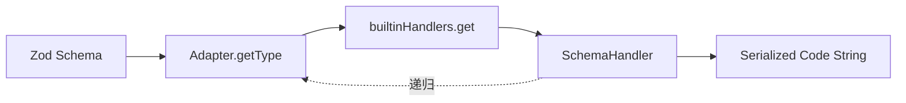

# Core 模块 - 序列化引擎核心

[根目录](../../CLAUDE.md) > [pkgs](../) > **core**

---

## 模块职责

`@zod-codepen/core` 是版本无关的 Zod Schema 序列化核心引擎，提供：
- 核心类型定义（`SerializeOptions`、`ZodAdapter`、`SchemaHandler` 等）
- 可扩展的处理器注册机制（`builtinHandlers`）
- 40+ 种内置 Schema 类型处理器（原语、集合、联合、修饰符、效果等）
- 数字格式化优化（`formatNumber`、`formatBigInt`）
- 序列化上下文管理（缩进、递归序列化、适配器调用）

**设计理念**：
- 版本中立：不依赖任何具体 Zod 版本，通过适配器模式解耦
- 可扩展：支持注册自定义 Schema 类型处理器
- 优化优先：默认开启语义化方法和科学记数法优化

---

## 入口与启动

### 主入口
- **文件**：`src/index.ts`
- **导出**：
  - 类型：`SerializeOptions`、`SchemaInfo`、`ZodAdapter`、`SchemaHandler`、`SerializerContext`
  - 函数：`createSerializer`、`formatNumber`、`formatBigInt`
  - 常量：`defaultOptions`、`builtinHandlers`

### 使用方式
```typescript
import { createSerializer } from '@zod-codepen/core';
import { zodV3Adapter } from '@zod-codepen/zod-v3';

const serializer = createSerializer(zodV3Adapter);
const code = serializer.serialize(mySchema);
```

---

## 对外接口

### 核心 API

#### `createSerializer(adapter: ZodAdapter)`
创建序列化器实例，绑定特定版本的适配器。

**返回值**：
```typescript
{
  serialize(schema: unknown, options?: SerializeOptions): string;
  generateModule(schemas: Record<string, unknown>, options?: SerializeOptions): string;
  registerHandler(type: string, handler: SchemaHandler): void;
}
```

#### `builtinHandlers: Map<string, SchemaHandler>`
内置处理器映射表，包含以下类型处理器：
- **原语**：string, number, boolean, bigint, date, undefined, null, void, any, unknown, never, nan, symbol
- **字面量与枚举**：literal, enum, nativeEnum
- **包装器**：optional, nullable, nullish, default, catch, readonly, branded
- **集合**：array, object, record, map, set, tuple
- **联合类型**：union, discriminatedUnion, intersection
- **高级**：lazy, promise, function, effects (transform/refine/superRefine/preprocess), pipe/pipeline

### 类型定义

#### `SerializeOptions`
```typescript
interface SerializeOptions {
  indent?: string;          // 默认：'  ' (两空格)
  indentLevel?: number;     // 默认：0
  format?: boolean;         // 默认：true
  optimizations?: {
    semanticMethods?: boolean;     // 默认：true
    scientificNotation?: boolean;  // 默认：true
  };
}
```

#### `ZodAdapter`
```typescript
interface ZodAdapter {
  getType(schema: unknown): string | undefined;
  getDef(schema: unknown): Record<string, unknown> | undefined;
  isZodSchema(value: unknown): boolean;
  version: 'v3' | 'v4';
}
```

---

## 关键依赖与配置

### 外部依赖
- **Peer Dependencies**：`zod >= 3.0.0`（可选，由适配器包提供）

### TypeScript 配置
- **文件**：`tsconfig.json`
- **编译选项**：
  - `target`: ES2022
  - `module`: ESNext
  - `declaration`: true（生成类型声明）
  - `strict`: true

### 构建输出
- **目录**：`dist/`
- **文件**：
  - `index.js` / `index.d.ts`（主入口）
  - `types.js` / `types.d.ts`（类型定义）
  - `serializer.js` / `serializer.d.ts`（核心序列化器）
  - `number-formatter.js` / `number-formatter.d.ts`（数字格式化）

---

## 数据模型

### 核心数据流



### SchemaHandler 函数签名
```typescript
type SchemaHandler = (
  schema: unknown,
  ctx: SerializerContext
) => string | undefined;
```

### SerializerContext 结构
```typescript
interface SerializerContext {
  adapter: ZodAdapter;
  options: Required<SerializeOptions>;
  indent: (level?: number) => string;
  serialize: (schema: unknown, indentLevel?: number) => string;
}
```

---

## 测试与质量

### 测试策略
- **本模块无独立测试**：逻辑通过 `@zod-codepen/zod-v3` 和 `@zod-codepen/zod-v4` 的测试覆盖
- **覆盖维度**：
  - 每个内置处理器都有对应的测试用例（在适配器包中）
  - 数字格式化：专门的 `number-formatting.test.ts`
  - 边界情况：空值、嵌套、循环引用（lazy）

### 质量工具
- **Lint**：根级 ESLint 配置
- **类型检查**：`tsc --noEmit`

---

## 常见问题 (FAQ)

### Q1: 为什么 core 包不包含 Zod 依赖？
A: 为了保持版本中立，core 通过适配器模式解耦 Zod 版本依赖，避免用户安装多个 Zod 版本。

### Q2: 如何添加自定义 Schema 类型支持？
A: 使用 `registerHandler(type, handler)` 注册自定义处理器：
```typescript
import { createSerializer } from '@zod-codepen/core';
import { zodV3Adapter } from '@zod-codepen/zod-v3';

const serializer = createSerializer(zodV3Adapter);
serializer.registerHandler('customType', (schema, ctx) => {
  return 'z.custom(/* ... */)';
});
```

### Q3: 数字格式化优化支持哪些转换？
A: 支持以下转换（详见 `number-formatter.ts`）：
- `Number.MAX_SAFE_INTEGER` / `Number.MIN_SAFE_INTEGER`
- 2 的幂次：`2**31 - 1`（INT32_MAX）、`-2**31`（INT32_MIN）等
- BigInt：`2n**63n - 1n`（INT64_MAX）等

### Q4: 如何禁用代码优化？
A:
```typescript
serialize(schema, {
  optimizations: {
    semanticMethods: false,      // 禁用 .positive() 等语义方法
    scientificNotation: false,   // 禁用 2**31-1 等科学记数法
  }
});
```

---

## 相关文件清单

### 源代码
- `src/index.ts`（14 行）：模块入口
- `src/types.ts`（75 行）：类型定义
- `src/serializer.ts`（~1100 行）：核心序列化器与内置处理器
- `src/number-formatter.ts`（132 行）：数字格式化工具

### 配置文件
- `package.json`：包元数据与脚本
- `tsconfig.json`：TypeScript 编译配置

### 构建产物
- `dist/`：编译后的 ESM 模块与类型声明

---

## 变更记录 (Changelog)

### 2025-12-11
- 初始化模块文档
- 完成核心架构扫描与分析
- 新增数字格式化优化说明
