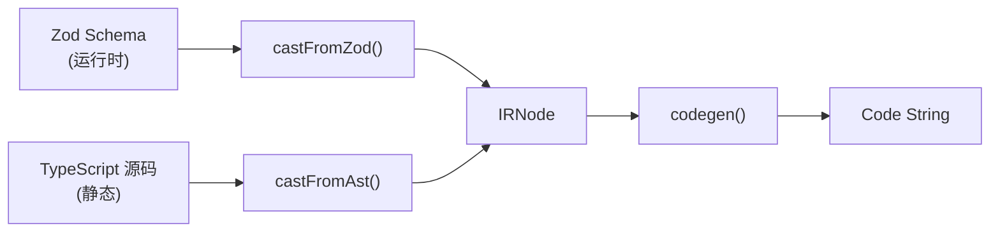

# Core 模块 - 序列化引擎核心

[根目录](../../CLAUDE.md) > [pkgs](../) > **core**

---

## 模块职责

`@zod-codepen/core` 是版本无关的 Zod Schema 序列化核心引擎，基于 IR（中间表示）架构：

- **IR 节点定义**：21 种纯数据节点类型（`pkgs/core/src/ir/nodes.ts`）
- **Codegen**：IR → TypeScript 代码字符串（`pkgs/core/src/ir/printer/codegen.ts`，纯函数）
- **双 cast 路径**：
  - `castFromZod()`：运行时 Zod 对象 → IR（`pkgs/core/src/cast/runtime.ts`）
  - `castFromAst()`：静态 TypeScript 源码 → IR（`pkgs/core/src/cast/ast.ts`）
- **序列化器薄壳**：路由到 IR 管道（`pkgs/core/src/serializer.ts`，仅 142 行）
- 数字格式化优化（`formatNumber`、`formatBigInt`）

**设计理念**：

- 版本中立：不依赖任何具体 Zod 版本，通过适配器模式解耦
- 纯数据 IR：IR 节点无行为，渲染逻辑集中在 codegen 中
- 双路径合并：运行时 cast 和静态 AST cast 产出一致的 IR 节点

---

## 入口与启动

### 主入口

- **文件**：`src/index.ts`
- **导出**：
  - IR 节点类型：`PrimitiveNode`, `ModifiedNode`, `LiteralNode`, `EnumNode`, `ObjectNode`, `UnionNode` 等 21 种
  - Cast 函数：`castFromZod`, `castFromAst`, `castAllFromAst`
  - Codegen：`codegen`, `CodegenOptions`
  - 提取工具：`extractSchemaExports`, `ModuleResolver`, `makeAstResolver`
  - 序列化器：`createSerializer`, `formatNumber`, `formatBigInt`
  - 类型：`SerializeOptions`, `ZodAdapter`, `IRNode` 等
  - 常量：`defaultOptions`

### 使用方式

```typescript
import { createSerializer } from "@zod-codepen/core";
import { zodV3Adapter } from "@zod-codepen/zod-v3";

const serializer = createSerializer(zodV3Adapter);
const code = serializer.serialize(mySchema);
```

---

## 对外接口

### 核心 API

#### `createSerializer(adapter: ZodAdapter)`

创建序列化器实例，绑定特定版本的适配器。内部将请求路由到 IR 管道（castFromZod → IR → codegen）。

**返回值**：

```typescript
{
  serialize(schema: unknown, options?: SerializeOptions): string;
  generateModule(schemas: Record<string, unknown>, options?: SerializeOptions): string;
}
```

### 类型定义

#### `SerializeOptions`

```typescript
interface SerializeOptions {
  indent?: string; // 默认：'  ' (两空格)
  indentLevel?: number; // 默认：0
  format?: boolean; // 默认：true
  optimizations?: {
    semanticMethods?: boolean; // 默认：true
    scientificNotation?: boolean; // 默认：true
  };
}
```

#### IR API

##### `castFromAst(source, exportName, opts?)`

从 TypeScript 源码文本中提取单个 export 的 Zod schema，返回 `IRNode`。

- 若 export 不存在 → 返回 `FallbackNode`
- 若 schema 不识别 → 返回 `RawNode`

##### `castAllFromAst(source, opts?)`

提取所有 export，返回 `Array<{ name: string; ir: IRNode }>`。

##### `codegen(ir, opts?)`

将 IR 节点渲染为 TypeScript 代码字符串。

##### `ModuleResolver`

跨文件 schema 解析器，支持相对路径 import 追踪。

#### `ZodAdapter`

```typescript
interface ZodAdapter {
  getType(schema: unknown): string | undefined;
  getDef(schema: unknown): Record<string, unknown> | undefined;
  isZodSchema(value: unknown): boolean;
  version: "v3" | "v4";
}
```

---

## 关键依赖与配置

### 外部依赖

- **Peer Dependencies**：`zod >= 3.0.0`（可选，由适配器包提供）

### TypeScript 配置

- **文件**：`tsconfig.json`
- **编译选项**：
  - `target`: ES2022
  - `module`: ESNext
  - `declaration`: true（生成类型声明）
  - `strict`: true

### 构建输出

- **目录**：`dist/`
- **文件**：
  - `index.js` / `index.d.ts`（主入口）
  - `types.js` / `types.d.ts`（类型定义）
  - `serializer.js` / `serializer.d.ts`（核心序列化器）
  - `number-formatter.js` / `number-formatter.d.ts`（数字格式化）

---

## 数据模型

### 核心数据流


```mermaid
graph LR
    A["Zod Schema<br/>(运行时)"] --> B["castFromZod()"]
    C["TypeScript 源码<br/>(静态)" ] --> D["castFromAst()"]
    B --> E[IRNode]
    D --> E
    E --> F["codegen()"]
    F --> G["Code String"]
```

### IRNode 类型

21 种纯数据节点类型，定义在 `pkgs/core/src/ir/nodes.ts`：

- 基础：`PrimitiveNode`, `LiteralNode`, `EnumNode`
- 复合：`ObjectNode`, `ArrayNode`, `TupleNode`, `RecordNode`, `MapNode`, `SetNode`
- 修饰：`ModifiedNode`（分离 optional/nullable/default/brand 等修饰符）
- 约束：`ConstraintNode`（分离 min/max/email/url 等约束）
- 组合：`UnionNode`, `IntersectionNode`
- 效果：`TransformNode`, `RefineNode`, `PreprocessNode`, `PipeNode`
- 其他：`LazyNode`, `ZodFunctionNode`, `PromiseNode`, `FallbackNode`, `RawNode`

---

## 测试与质量

### 测试策略

- **本模块 4 个测试文件，129 个测试**：
  - `ast-utils.test.ts` — AST 工具函数测试
  - `cast-ast.test.ts` — 静态 AST cast 测试（420 行，涵盖 primitives/constraints/collections/objects/tuples/unions/wrapper inlining/edge cases）
  - `extract.test.ts` — 模块导出提取测试
  - `resolver.test.ts` — 跨文件 ModuleResolver 测试
- **覆盖维度**：
  - 所有 IR 节点类型的 codegen 渲染
  - castFromAst 覆盖所有基础 Zod 类型
  - 跨文件 import 解析与循环依赖处理
  - 边界情况：空值、嵌套、循环引用（lazy）

### 质量工具

- **Lint**：根级 ESLint 配置
- **类型检查**：`tsc --noEmit`
- **测试**：`pnpm --filter @zod-codepen/core test`

---

## 常见问题 (FAQ)

### Q1: 为什么 core 包不包含 Zod 依赖？

A: 为了保持版本中立，core 通过适配器模式解耦 Zod 版本依赖。IR 节点定义和 codegen 完全不依赖 Zod，只处理纯数据结构。版本差异在 cast 层通过 adapter 归一化。

### Q2: 如何添加自定义 Schema 类型支持？

A: 使用 `registerHandler(type, handler)` 注册自定义处理器：

```typescript
import { createSerializer } from "@zod-codepen/core";
import { zodV3Adapter } from "@zod-codepen/zod-v3";

const serializer = createSerializer(zodV3Adapter);
serializer.registerHandler("customType", (schema, ctx) => {
  return "z.custom(/* ... */)";
});
```

### Q3: 数字格式化优化支持哪些转换？

A: 支持以下转换（详见 `number-formatter.ts`）：

- `Number.MAX_SAFE_INTEGER` / `Number.MIN_SAFE_INTEGER`
- 2 的幂次：`2**31 - 1`（INT32_MAX）、`-2**31`（INT32_MIN）等
- BigInt：`2n**63n - 1n`（INT64_MAX）等

### Q4: 如何禁用代码优化？

A:

```typescript
serialize(schema, {
  optimizations: {
    semanticMethods: false, // 禁用 .positive() 等语义方法
    scientificNotation: false, // 禁用 2**31-1 等科学记数法
  },
});
```

---

## 相关文件清单

### 源代码

- `src/index.ts`：模块入口，导出所有公共 API
- `src/ir/nodes.ts`（322 行）：21 种 IR 节点类型定义
- `src/ir/printer/codegen.ts`（577 行）：IR → TypeScript 代码字符串
- `src/cast/runtime.ts`（689 行）：运行时 castFromZod
- `src/cast/ast.ts`（1329 行）：静态 AST castFromAst
- `src/cast/constraints.ts`（196 行）：约束归一化
- `src/cast/version.ts`（270 行）：v3/v4 差异归一化
- `src/cast/ast-utils.ts`（331 行）：AST 工具函数
- `src/extract/module.ts`（253 行）：ModuleResolver 跨文件解析
- `src/extract/inline.ts`（105 行）：包装函数内联
- `src/serializer.ts`（142 行）：序列化器薄壳
- `src/number-formatter.ts`（132 行）：数字格式化工具

### 配置文件

- `package.json`：包元数据与脚本
- `tsconfig.json`：TypeScript 编译配置

### 构建产物

- `dist/`：编译后的 ESM 模块与类型声明

---

## 变更记录 (Changelog)

### 2026-07-05

- 重构为 IR 架构：新增 21 种 IR 节点类型、codegen、双 cast 路径
- 新增静态 AST 提取管线（castFromAst / castAllFromAst / ModuleResolver）
- 序列化器从 ~1100 行瘦身到 142 行
- 新增 4 个测试文件，129 个测试

### 2025-12-11

- 初始化模块文档
- 完成核心架构扫描与分析
- 新增数字格式化优化说明
