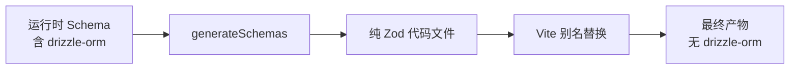

# Vite Plugin 模块 - Schema 解耦插件

[根目录](../../CLAUDE.md) > [pkgs](../) > **vite-plugin**

---

## 模块职责

`@zod-codepen/vite-plugin` 是 Vite 构建插件，用于在构建时将 Zod Schema 解耦，解决以下问题：
- **运行时依赖体积**：将重依赖（如 drizzle-orm）从最终产物中移除
- **构建时代码生成**：预先序列化 Schema 为纯 Zod 代码
- **模块别名替换**：在构建时用生成的纯 Schema 文件替换原始导入

**应用场景**：
- Cloudflare Workers 等对包体积敏感的环境
- 需要在运行时使用 Zod 验证，但不想打包 ORM 的项目
- 将运行时复杂 Schema 定义转换为编译时静态代码

---

## 入口与启动

### 主入口
- **文件**：`src/index.ts`（470 行）
- **导出**：
  - `zodDecoupling` - 完整插件（自动生成 + 别名）
  - `zodDecouplingAlias` - 仅别名插件
  - `generateSchemas` - 独立生成函数
  - `createZodV3Adapter` / `createZodV4Adapter` - 适配器工厂

### 使用模式

#### 模式 1：独立脚本 + 别名插件（推荐）
```typescript
// scripts/generate-schemas.ts
import { generateSchemas } from '@zod-codepen/vite-plugin';
import * as schemas from '../src/runtime/schema.js';

await generateSchemas({
  schemas,
  outputPath: './src/generated/api-schemas.ts',
  zodVersion: 'v4',
});
```

```typescript
// vite.config.ts
import { zodDecouplingAlias } from '@zod-codepen/vite-plugin';

export default defineConfig({
  plugins: [
    zodDecouplingAlias({
      aliasFrom: '../runtime/schema.js',
      aliasTo: './src/generated/api-schemas.ts',
    }),
  ],
});
```

#### 模式 2：一体化插件（简单场景）
```typescript
// vite.config.ts
import { zodDecoupling } from '@zod-codepen/vite-plugin';

export default defineConfig({
  plugins: [
    zodDecoupling({
      schemaEntry: './src/runtime/schema.ts',
      outputPath: './src/generated/api-schemas.ts',
      aliasFrom: '../runtime/schema.js',
      zodVersion: 'v4',
    }),
  ],
});
```

---

## 对外接口

### 核心函数

#### `generateSchemas(options: GenerateSchemaOptions): Promise<void>`
独立生成函数，将运行时 Schema 序列化为纯 Zod 代码文件。

**选项**：
```typescript
interface GenerateSchemaOptions {
  schemas: Record<string, unknown>;       // Schema 映射对象
  outputPath: string;                     // 输出文件路径
  zodVersion?: 'v3' | 'v4';               // 默认 'v4'
  filter?: (name: string, schema: unknown) => boolean; // 过滤器
  includeTypes?: boolean;                 // 是否导出类型（默认 true）
  header?: string;                        // 自定义文件头
  serializeOptions?: SerializeOptions;    // 序列化选项
  verbose?: boolean;                      // 详细日志
}
```

**输出示例**：
```typescript
/**
 * AUTO-GENERATED FILE - DO NOT EDIT
 *
 * Generated by @zod-codepen/vite-plugin at 2025-12-11T03:00:00.000Z
 */

import { z } from 'zod';

export const User = z.object({
  id: z.number(),
  name: z.string(),
  email: z.string().email()
});

export const Status = z.enum(["active", "inactive"]);

// Type exports
export type User = z.infer<typeof User>;
export type Status = z.infer<typeof Status>;
```

### Vite 插件

#### `zodDecouplingAlias(options: ZodDecouplingAliasOptions): Plugin`
仅设置模块别名的轻量级插件。

**选项**：
```typescript
interface ZodDecouplingAliasOptions {
  aliasFrom: string;  // 要替换的导入路径（如 '../runtime/schema.js'）
  aliasTo: string;    // 目标文件路径（如 './src/generated/api-schemas.ts'）
}
```

**工作原理**：
```typescript
// 构建前：
import { User } from '../runtime/schema.js';

// 构建后（通过 Vite resolve.alias）：
import { User } from './src/generated/api-schemas.ts';
```

#### `zodDecoupling(options): Plugin`
完整插件，在 `buildStart` 钩子自动生成 Schema 文件并设置别名。

**选项**：扩展 `GenerateSchemaOptions` + `aliasFrom`

**注意**：需要 schema 文件在构建时可导入（不能依赖运行时专用库如 drizzle-orm）。

### 工具函数

#### `createZodV3Adapter(): ZodAdapter`
创建 Zod v3 适配器（用于独立脚本）。

#### `createZodV4Adapter(): ZodAdapter`
创建 Zod v4 适配器（用于独立脚本）。

#### `defaultFilter(name: string): boolean`
默认过滤器，排除：
- 以 `$` 开头的导出（内部变量）
- 以 `Type` 结尾的导出（仅类型）

---

## 关键依赖与配置

### 依赖项
- **Dependencies**：`@zod-codepen/core@workspace:*`
- **Peer Dependencies**：
  - `vite@>=5.0.0`
  - `zod@>=3.0.0 || >=4.0.0`（可选）
- **Dev Dependencies**：
  - `@types/node@^22.10.1`
  - `typescript@^5.7.2`
  - `vite@^6.0.3`
  - `zod@^4.1.13`

### Node.js API 使用
本插件使用 Node.js 文件系统 API：
- `fs.existsSync` - 检查目录
- `fs.mkdirSync` - 创建目录
- `fs.writeFileSync` - 写入文件
- `path.resolve` / `path.dirname` - 路径解析

### 包信息
- **包名**：`@zod-codepen/vite-plugin`
- **版本**：`1.0.1`
- **许可证**：MPL-2.0

---

## 数据模型

### 工作流程



### 过滤逻辑
```typescript
// 默认过滤器
const defaultFilter = (name: string) => {
  if (name.endsWith('Type')) return false;  // 跳过类型导出
  return !name.startsWith('$');              // 包含非内部变量
};
```

### 生成的文件结构
```
生成文件头
↓
import { z } from 'zod';
↓
Schema 导出（export const xxx = z...）
↓
类型导出（export type xxx = z.infer<...>）
```

---

## 测试与质量

### 测试策略
- **本模块无单元测试**：功能通过集成测试验证
- **验证方式**：
  - 在真实 Vite 项目中测试别名替换
  - 检查生成文件的正确性
  - 验证构建产物体积减少

### 质量保证
- TypeScript 类型检查
- 根级 ESLint 配置
- 手动集成测试（在示例项目中）

### 待改进
- [ ] 添加单元测试（模拟 Vite 插件钩子）
- [ ] 添加 E2E 测试（真实 Vite 项目）
- [ ] 添加生成文件快照测试

---

## 常见问题 (FAQ)

### Q1: 为什么推荐独立脚本模式而不是一体化插件？
A: 独立脚本模式更灵活：
- 可以在 Vite 外部运行（如 CI/CD）
- 不受 Vite 构建时导入限制（可以依赖 drizzle-orm）
- 更容易调试和版本控制生成的文件

### Q2: 如何在 package.json 中添加生成脚本？
A:
```json
{
  "scripts": {
    "generate:schemas": "tsx scripts/generate-schemas.ts",
    "build": "pnpm generate:schemas && vite build"
  }
}
```

### Q3: 生成的文件应该提交到 Git 吗？
A: 推荐提交：
- ✅ 可以追踪 Schema 变更历史
- ✅ 团队成员无需运行生成脚本即可构建
- ✅ CI/CD 更稳定（不依赖运行时库）

但也可以不提交：
- ⚠️ 需要在 CI/CD 中运行生成脚本
- ⚠️ 需要确保所有开发者本地都运行了生成

### Q4: 如何自定义过滤器？
A:
```typescript
await generateSchemas({
  schemas,
  outputPath: './generated.ts',
  filter: (name, schema) => {
    // 只包含以 'Api' 开头的 Schema
    return name.startsWith('Api');
  },
});
```

### Q5: 插件支持 HMR（热更新）吗？
A: `zodDecouplingAlias` 插件只做别名替换，不影响 HMR。但独立脚本模式需要手动重新生成文件。

推荐：
- 开发时直接导入运行时 Schema（跳过别名）
- 构建时使用生成的文件（通过环境变量切换）

---

## 相关文件清单

### 源代码
- `src/index.ts`（470 行）：完整插件实现
  - 适配器工厂（v3/v4）
  - `generateSchemas` 函数
  - `zodDecouplingAlias` 插件
  - `zodDecoupling` 完整插件

### 配置文件
- `package.json`：包元数据与脚本
- `tsconfig.json`：TypeScript 编译配置

### 构建产物
- `dist/index.js` / `index.d.ts`

---

## 变更记录 (Changelog)

### 2025-12-11
- 初始化模块文档
- 完成插件架构扫描
- 新增使用模式与工作流程说明
- 补充常见问题与最佳实践
